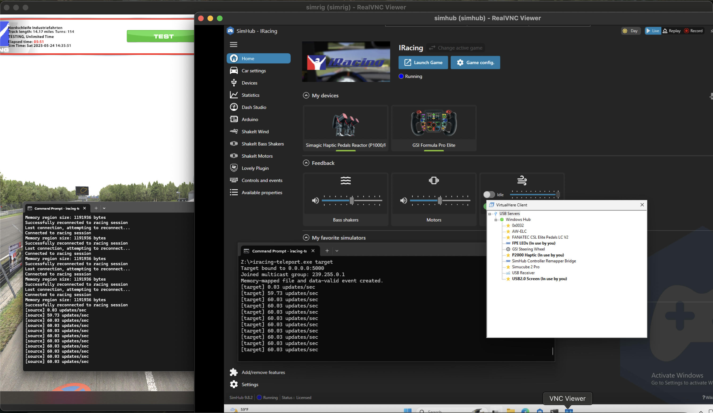

# iRacing Telemetry Teleport

A tool that allows you to access iRacing's telemetry data on a remote computer. This is particularly useful when you want to run telemetry applications like SimHub on a different machine than your iRacing computer.



## Download

⬇️ [Download Latest Release](https://github.com/sklose/iracing-teleport/releases/latest/download/iracing-teleport.zip)

## How It Works

The tool consists of two components:
1. **Source**: Runs on your iRacing computer, reads the telemetry data, and forwards it over the network
2. **Target**: Runs on your remote computer, receives the data, and creates a local memory-mapped file that simulates iRacing's telemetry interface

Features:
- LZ4 compression to reduce network usage
- Support for both unicast and multicast (default) communication
- Low latency - less than 1ms in added latency over ethernet

## Usage Examples

### Default Setup (Multicast)

1. On the remote computer (where SimHub runs):
```bash
# Listen for telemetry data
iracing-teleport target
```

2. On the iRacing computer:
```bash
# Send telemetry data
iracing-teleport source
```

This uses the default multicast address (239.255.0.1:5000) which allows multiple remote computers to receive the data.

### Custom Multicast Setup

1. On the remote computer:
```bash
# Listen on a specific interface and multicast group
iracing-teleport target --bind 192.168.1.10:5000 --group 239.255.0.2
```

2. On the iRacing computer:
```bash
# Send to the custom multicast group
iracing-teleport source --bind 192.168.1.5:0 --target 239.255.0.2:5000
```

### Unicast Setup (Point-to-Point)

1. On the remote computer:
```bash
# Listen for direct connection
iracing-teleport target --unicast --bind 192.168.1.10:5000
```

2. On the iRacing computer:
```bash
# Send directly to the remote computer
iracing-teleport source --unicast --target 192.168.1.10:5000
```

## Tips

- Use multicast (the default) if you want to receive telemetry on multiple computers or can't be bothered to manually specify the IP details
- Use unicast if you have network issues with multicast or only need one receiver
- The source will automatically reconnect if iRacing is restarted
- The target will automatically reconnect if the source connection is lost

## Requirements

- Windows (for iRacing telemetry access)
- Network connectivity between the computers
- UDP port access (default: 5000)
- Multicast support on your network (if not using unicast)
- 15 Mbps of available network bandwidth - preferably wired to keep latencies low